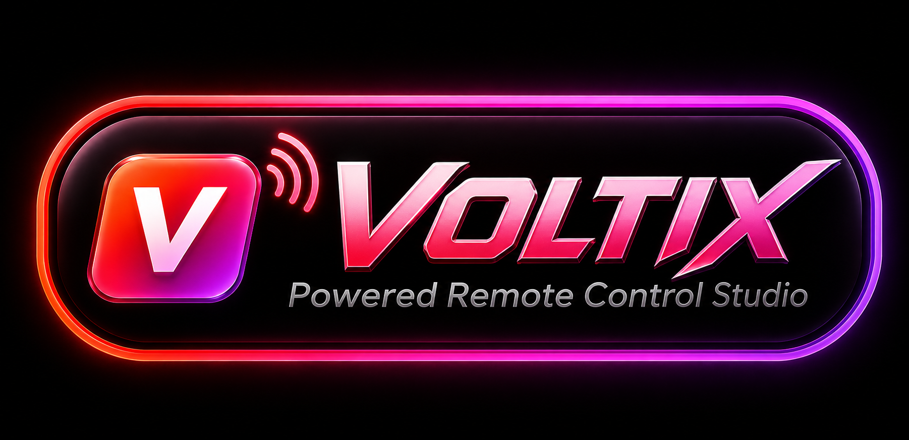

<p align="center">
  
</p>

<p align="center">
  <strong>Powered Remote Control Studio</strong>
</p>

# Voltix Remote Studio

Voltix Remote Studio is a local desktop control surface for supported smart TVs on the same network.

## Current supported control paths

- LG webOS over the LG webOS socket protocol.
- Roku over the Roku External Control Protocol.
- Samsung Tizen over the Samsung remote websocket path.

The application keeps the control logic separate from the visual layer. The editable user interface files are stored under:

```text
app/src/renderer/index.html
app/src/renderer/style.css
app/src/renderer/renderer.js
```

The control code is stored under:

```text
app/src/backend/
```

## Run

```bash
./run.sh
```

## Notes

Pairing keys and device history are stored in the user configuration folder for the active installation.

Contact the developer for questions, comments, support, or licensing information.

© 2026 Christopher Ryan. All rights reserved.
